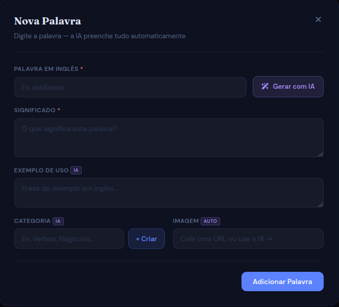
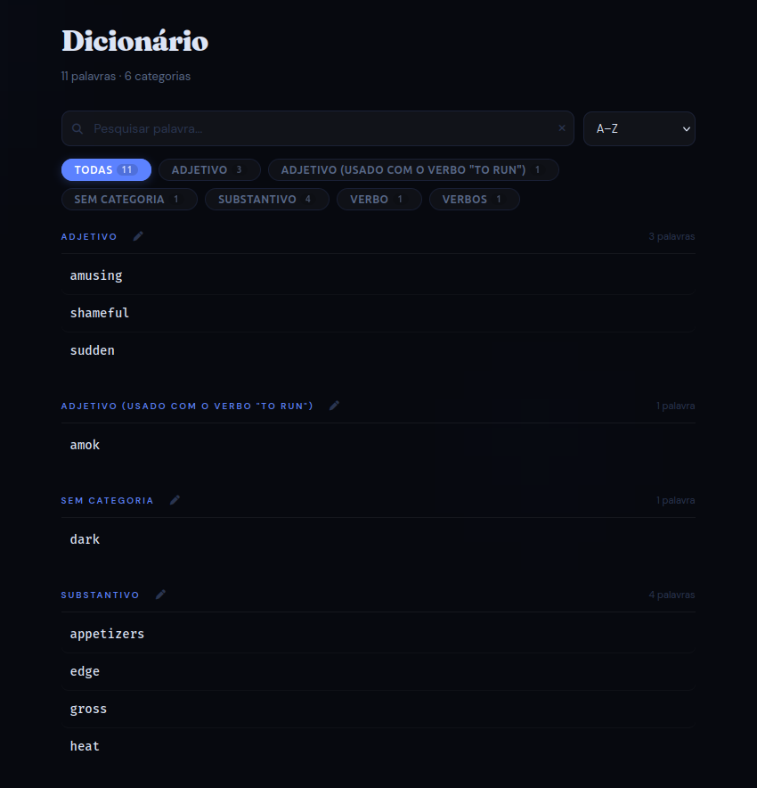

# 📚 Dicionário Pessoal de Vocabulário em Inglês

Este é um projeto **Web App** focado em acelerar o aprendizado de vocabulário em inglês. Sua metodologia central é o "estudo ativo", que exige a busca e o salvamento intencional de palavras para solidificar o conhecimento.






### 🔗 Acesse o Site: [Clique aqui para começar a buscar e salvar palavras!](https://ramalho-sites.github.io/dicionario-ingles/)

---

## 🎯 Objetivo e Metodologia

O foco principal deste site é servir como uma **ferramenta de retenção de vocabulário**, baseada na premissa de que a ação de buscar ativamente uma palavra e salvá-la no seu ambiente de estudo pessoal aumenta drasticamente a memorização.

O projeto é ideal para estudantes que desejam:
1.  **Forçar a Busca:** Anotar apenas palavras que geram real dúvida.
2.  **Organização Pessoal:** Manter um banco de dados próprio e customizado de palavras-chave.
3.  **Revisão Ativa:** Facilitar a revisão periódica do vocabulário salvo.

---

## ✨ Funcionalidades

* **Busca de Palavras:** Pesquisa rápida de termos em inglês (via API externa).
* **Salvamento Persistente:** Salve definições, exemplos de uso e a própria palavra na sua lista pessoal.
* **Local Storage:** Os dados da sua lista de vocabulário são salvos no seu navegador para que a lista permaneça acessível em todas as sessões.
* **Design Intuitivo:** Interface limpa e responsiva focada na legibilidade e na experiência de estudo.

---

## 🛠️ Tecnologias Utilizadas

| Tecnologia | Função no Projeto |
| :--- | :--- |
| **HTML5** | Estrutura semântica do aplicativo web. |
| **CSS3** | Estilização, layout e design responsivo. |
| **JavaScript (ES6+)** | Lógica de busca, manipulação do DOM e gerenciamento do Local Storage. |

---

## 🚀 Como Executar Localmente

1.  **Clone o repositório:**
    ```bash
    git clone [https://github.com/Ramalho-Sites/dicionario-ingles.git](https://github.com/Ramalho-Sites/dicionario-ingles.git)
    ```

2.  **Navegue até a pasta:**
    ```bash
    cd dicionario-ingles
    ```

3.  **Abra o `index.html`:**
    O projeto pode ser executado diretamente no seu navegador.

---

## 👨‍💻 Autor

###### Feito   por **Davi Ramalho**.

[](https://github.com/Ramalho-Sites)
[](https://www.linkedin.com/in/davi-ramalho-146221379/)